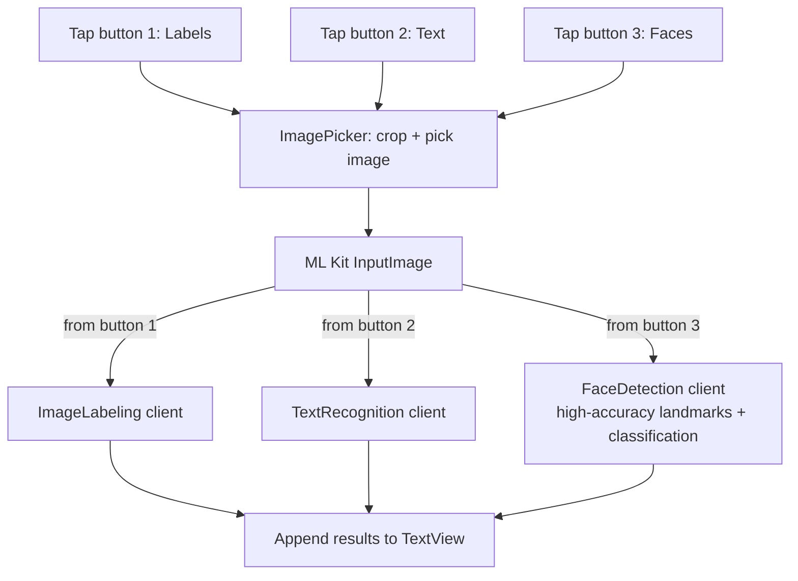

# ObjectDetection-TextRecognization-faceReccognization

Android playground app combining three Google ML Kit vision features behind three buttons: image labeling (object detection), text recognition (OCR), and face detection.

## How it works

Each of the three buttons opens the gallery via `ImagePicker` (with cropping enabled) for a different downstream task. Once an image is picked, it's wrapped in an ML Kit `InputImage` and routed to the corresponding ML Kit client based on which button triggered the pick: `ImageLabeling` for general object/scene labels, `TextRecognition` for OCR, or `FaceDetection` (configured for high-accuracy landmarks + classification) for face analysis. Results are appended to a scrollable on-screen text view.

## Architecture

| File | Role |
|---|---|
| `MainActivity.kt` | Image picking + routing to the three ML Kit clients, result display |

## Tech stack

Kotlin · Android · Google ML Kit (Image Labeling, Text Recognition, Face Detection) · ImagePicker

## Setup

Open in Android Studio and run on an emulator/device.
